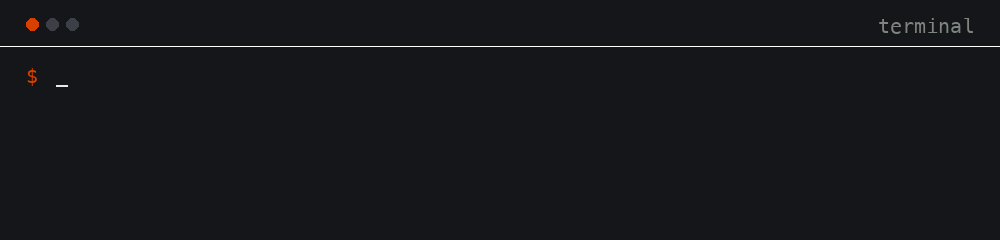

# imzip

A command-line tool for compressing, resizing and converting images. Point it at one file, a folder, or a glob pattern and it works through everything in parallel with a progress bar. A corrupt file gets its own line in the report while the rest of the batch keeps going, and the exit code at the end tells you exactly what happened.

Encoding is handled by mozjpeg for JPEG, oxipng and imagequant for PNG, libwebp for WebP and ravif for AVIF. AVIF input is decoded with dav1d.

Measured on a 182 KB phone photo: quality 60 JPEG comes out at 4 KB. A 936 KB screenshot becomes a 20 KB WebP under a `--target-size 30KB` budget.



## Features

- Batch input: files, directories (`-r` to recurse) and glob patterns like `**/*.jpg`, deduplicated, processed across all cores.
- Per-format compression controls, a `--target-size 200KB` mode that searches quality for you, and logic that skips files which would only get bigger.
- Resize by dimensions, percentage, edge limits or megapixel cap. Upscaling is off unless you pass `--allow-upscale`.
- Conversion between JPEG, PNG, WebP, AVIF and static GIF, with alpha flattened onto a background color when the target format has none.
- Three explicit metadata modes, implemented at the byte level for JPEG, PNG and WebP.
- A config file (`imzip.toml` or `.imziprc`) discovered from the current directory upward. CLI flags beat config values.
- `--dry-run`, `--quiet`, `--verbose` and exit codes 0/1/2, so it behaves in scripts and CI.

## Install

One command, straight from the repo:

```sh
cargo install --git https://github.com/Alyetama/ImZip
```

Or from a local clone:

```sh
git clone https://github.com/Alyetama/ImZip
cd ImZip
cargo install --path .
```

Either way you need a Rust toolchain ([rustup](https://rustup.rs) is the easy way to get one) and a C toolchain, because mozjpeg, libwebp and dav1d compile bundled C code. On aarch64 no nasm is required.

## Quick start

```sh
imzip photo.jpg                      # writes photo_imzip.jpg with default settings
imzip photo.jpg -q 60                # JPEG quality 60
imzip images/ -o out/ --percent 50   # batch resize into out/
imzip pic.png --format webp --target-size 200KB
imzip images/ -r --strip-all-metadata --in-place
```

## Flag reference

### Input and output

| Flag | Description |
|---|---|
| `<INPUT>...` | Files, directories or glob patterns (`*.jpg`, `**/*.png`). Directories are scanned one level deep unless `-r` is given. Globs walk as deep as the pattern requires. |
| `-r, --recursive` | Recurse into input directories. |
| `-o, --output <DIR>` | Write outputs into `DIR`. Directory and glob inputs keep their relative structure under it. |
| `--in-place` | Overwrite input files (conflicts with `-o`). If `--format` changes the extension, a sibling file with the new extension is written and the original is kept. |
| `--name-template <T>` | Output name template, may contain subdirectories. Placeholders: `{name}` `{ext}` `{format}` `{width}` `{height}` `{index}` `{parent}`. Default: `{name}_imzip.{ext}`, used only when neither `-o` nor `--in-place` is given. |
| `--dry-run` | Print the planned `input -> output` mapping plus resize, format and quality decisions. Writes nothing. |
| `--force` | Overwrite existing outputs and override both skip rules described below. |

Two skip rules are on by default:

- With `--target-size`, a file that is already under the target is skipped.
- A pure recompress (no resize, no format change) that would come out larger than the input is skipped and reported as already optimal.

Without `--force`, an existing output file is an error for that file, never a silent overwrite. `--in-place` is the exception.

### Resize

The resize modes are mutually exclusive:

| Flag | Description |
|---|---|
| `--width <PX>` / `--height <PX>` | Both together: exact size. One alone: scale the other dimension to keep the aspect ratio. |
| `--percent <F>` | Scale to a percentage, e.g. `50` or `33.3`. |
| `--max-width <PX>` / `--max-height <PX>` | Downscale to at most this size. No-op if the image is already smaller. |
| `--longest-edge <PX>` | Downscale so the longest edge equals PX. |
| `--shortest-edge <PX>` | Scale so the shortest edge equals PX. |
| `--max-megapixels <F>` | Downscale to at most F megapixels, e.g. `2.0`. |
| `--allow-upscale` | Permit enlarging. By default imzip never upscales and up-only requests become no-ops. |
| `--filter <F>` | Resampling filter: `nearest`, `triangle`, `catmull-rom` or `lanczos3` (default). |

### Compression

| Flag | Description |
|---|---|
| `-q, --quality <0-100>` | Quality for the lossy formats (JPEG, WebP, AVIF). Default: 75. |
| `--progressive` | Write progressive JPEG. |
| `--chroma-subsampling <MODE>` | JPEG chroma subsampling: `444`, `422` or `420`. Default: 420. |
| `--png-compression <0-6>` | oxipng optimization preset. Default: 2. |
| `--png-colors <2-256>` | Quantize the PNG to an N-color palette with imagequant, then optimize. |
| `--webp-lossless` | Write lossless WebP. |
| `--avif-speed <1-10>` | ravif speed. 1 is slowest and smallest. Default: 6. |
| `--target-size <SIZE>` | e.g. `200KB`, `1.5MB`, `500K` or a plain byte count. imzip binary-searches the quality setting (1 to 100, at most 7 tries) and keeps the highest quality that fits the budget, or the smallest result if nothing fits. Works for JPEG, WebP and AVIF; asking for a size target on PNG or GIF is an error. |

`--target-size` uses SI units: 1 KB is 1000 bytes.

### Format

| Flag | Description |
|---|---|
| `--format <FMT>` | Convert the output format: `jpeg`, `png`, `webp`, `avif` or `gif`. Default: keep the input format. Inputs that imzip cannot re-encode (BMP, TIFF, TGA, ICO, PNM) are written as PNG. GIF output is a single static frame. |
| `--background <COLOR>` | Background used when flattening alpha for JPEG or GIF: `#RRGGBB`, or one of `white`, `black`, `red`, `green`, `blue`. Default: white. |

### Metadata

The three modes are mutually exclusive:

| Mode | EXIF / XMP / IPTC | ICC color profile |
|---|---|---|
| default | stripped | kept |
| `--strip-all-metadata` | stripped | stripped |
| `--keep-metadata` | copied over (best effort) | kept |

The default exists for a reason: EXIF often contains GPS coordinates and camera details you probably do not want to publish, while the ICC profile is what keeps colors correct. Dropping the first and keeping the second is the safe middle ground. If you want a completely clean file, take `--strip-all-metadata`. If you are archiving or passing files to another tool in a color-managed chain, take `--keep-metadata`.

Preservation is done by re-injecting the metadata into the encoded bytes:

| Format | ICC | EXIF | XMP |
|---|---|---|---|
| JPEG | Yes, APP2 `ICC_PROFILE` with multi-chunk reassembly | Yes, APP1 | Yes, APP1 |
| PNG | Yes, `iCCP` | Yes, `eXIf` | Yes, `iTXt` |
| WebP | Yes, `ICCP` | Yes, `EXIF` | Yes, `XMP ` (VP8X container rebuilt) |
| AVIF | No | No | No |
| GIF | No | No | No |

### Config and diagnostics

| Flag | Description |
|---|---|
| `--config <PATH>` | Use this config file. Default: search the current directory and its ancestors for `imzip.toml`, `.imziprc` or `.imzip.toml`. |
| `-j, --jobs <N>` | Parallel worker threads: a number, or `auto` for all CPU cores. Default: `auto`. |
| `--sequential` | Process files one at a time, no parallelism. Same as `--jobs 1`; handy for debugging or low-memory machines. Conflicts with `--jobs`. |
| `-v, --verbose` | Print one line per processed file, including the quality chosen by `--target-size`. |
| `--quiet` | Print errors only, to stderr. No progress bar, no summary. Note that `-q` means quality. |
| `--no-progress` | Disable the progress bar. It is also disabled automatically when stderr is not a terminal. |

The human-readable report goes to stdout. The progress bar and quiet-mode errors go to stderr, so piping the report somewhere never breaks the display.

## Exit codes

| Code | Meaning |
|---|---|
| 0 | Everything succeeded. Skipped files count as success. |
| 1 | One or more files failed. The batch still processed the rest. |
| 2 | Invalid arguments or usage: clap parse errors, bad config, unknown template placeholder, and so on. |

## Config file

Discovery order: `--config <PATH>` wins; otherwise the first of `imzip.toml`, `.imziprc`, `.imzip.toml` found in the current directory or any ancestor. Every field is optional, and the snake_case names match the long CLI flags. Precedence is CLI flag over config over built-in default.

```toml
# imzip.toml, example with every key
recursive = false
output = "out"
# in_place = false
# name_template = "{name}_min.{ext}"
dry_run = false
force = false
jobs = 8                   # worker threads; 0 or omit for auto (all cores)
verbose = false
quiet = false
no_progress = false

# resize: set one mode only
# width = 1200
# height = 800
# percent = 50.0
# max_width = 1920
# max_height = 1080
# longest_edge = 1920
# shortest_edge = 1080
# max_megapixels = 2.0
allow_upscale = false
filter = "lanczos3"        # nearest | triangle | catmull-rom | lanczos3

quality = 80               # 0-100
# target_size = "200KB"
format = "webp"            # jpeg | png | webp | avif | gif
background = "#ffffff"
strip_all_metadata = false
keep_metadata = false

[jpeg]
progressive = true
chroma_subsampling = "420" # 444 | 422 | 420

[png]
compression = 2            # 0-6
colors = 256               # 2-256

[webp]
lossless = false

[avif]
speed = 6                  # 1-10
```

## Examples

Compress a single file:

```sh
imzip photo.jpg -q 70
# photo_imzip.jpg is written next to the input
```

Resize a folder recursively into an output directory, keeping the structure:

```sh
imzip ~/Pictures/vacation -r -o out/ --longest-edge 1600 -q 80
```

Convert a PNG to WebP under a size budget:

```sh
imzip screenshot.png --format webp --target-size 200KB
# run with --verbose to see the quality the search landed on
```

Strip all metadata including the ICC profile, in place:

```sh
imzip images/ -r --strip-all-metadata --in-place --force
```

See what a run would do without writing anything:

```sh
imzip images/ -r --format avif --percent 50 --dry-run
```

Rename outputs with a template:

```sh
imzip "assets/**/*.png" -o dist/ --format webp --name-template "{parent}/{name}-{width}x{height}.{ext}"
# produces paths like dist/icons/logo-512x512.webp
```

Use it from shell loops and CI:

```sh
find . -name '*.jpg' -print0 | xargs -0 -n1 -P8 imzip -q 75 --quiet
for f in *.png; do imzip "$f" --format webp || echo "failed: $f"; done

imzip dist/ -r -q 75 --quiet || notifyFailure   # -q is quality here
```

## Known limitations

- AVIF and GIF outputs never carry metadata. AVIF input decoding works, via dav1d.
- GIF is static in both directions: only the first frame is read, and one frame is written.
- EXIF orientation is not applied when decoding; pixels are used as stored.
- BMP, TIFF, TGA, ICO and PNM inputs without `--format` are written as PNG, since imzip has no encoder for those formats.
- `--target-size` only works for lossy outputs (JPEG, WebP, AVIF) and uses SI units.

## Development

```sh
cargo build
cargo test        # unit and integration tests; fixtures are generated on the fly
```

Layout: `src/cli.rs` (clap parsing), `src/config.rs` (config file), `src/resize.rs` (pure resize math), `src/pipeline.rs` (per-file pipeline), `src/encoders/` (codec adapters), `src/metadata.rs` (byte-level ICC/EXIF/XMP), `src/batch.rs` (discovery and parallel runner), `src/report.rs` (report and exit codes).
